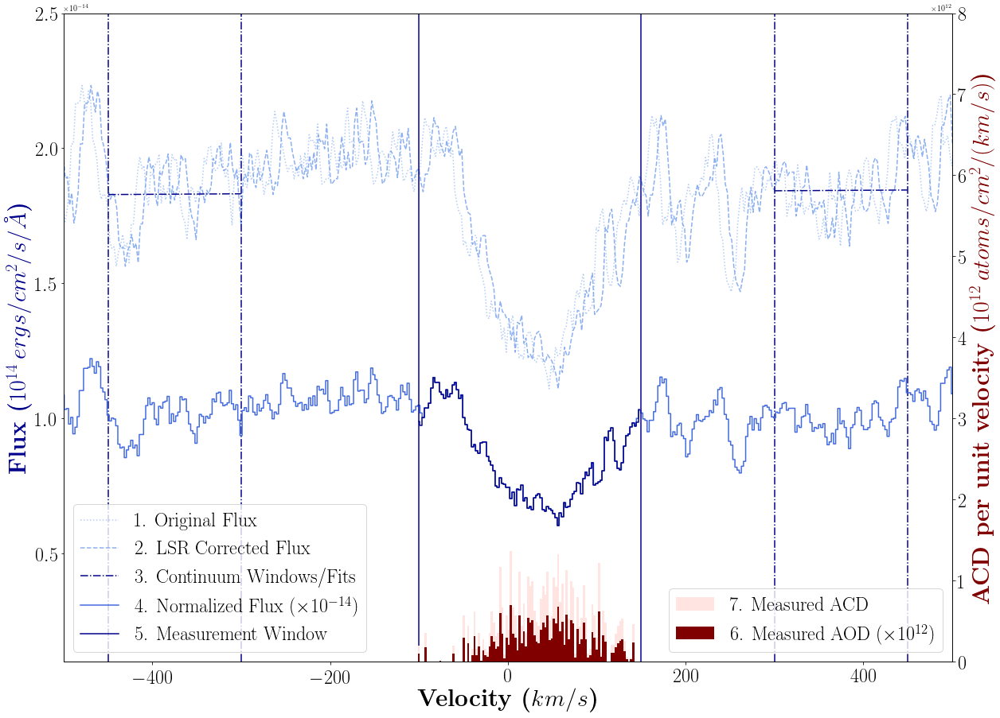

SpectrAOD
------------


`spectrAOD` is a package for measuring the apparent optical depth, and thus,
 the apparent column density for spectral absorption features as outlined by
 Savage and Sembach in their 1991 paper. Many researchers have their own 
 code for performing these measurements but we set out to create an 
 open-source, well-maintained python package for people who didn't want to 
 reinvent the wheel. Currently, the package has a limited use case scenario 
 for Cosmic Origins Spectrograph data at a redshift of zero, but we hope to 
 expand the capabilities of the package in terms of what missions are 
 supported, the computation abilities, and visualization for these 
 calculations. Stay tuned!

Installation
------------

This package is registered on PyPI and available via `pip`. `pip` 
installations will provide the latest version released to PyPI, and is 
sufficient for installing the package. However, in case you would like the 
latest version, between published releases, we also offer 
instructions on how to install by cloning the repository. You will need a 
working, and preferably current version of Anaconda.

> N.B.: If you are having any issues with installation, please consult the 
[Common Issues](#common-issues) section.

##### Make a new environment
```
conda create --name <environment_name> python=3.5 <other packages>
```
`<other packages>` simply denotes any other packages you may wish to install
 in this environment, such as `stsci` or `notebook`. All required packages 
 for `spectrAOD` will be installed as a dependency automatically.
 
Activate the new environment with:
```
conda activate <environment_name>
```
We recommend a short and simple name for the environment such as `spectraod`.

##### Install with `pip` (Latest published release, recommended)

From the command line, in your new environment:
```
pip install spectrAOD==1.0.0
```

You can drop the version number and just use the name of the package if you 
would like the version most recently published. `pip` will also give you 
instructions on how to upgrade your version if there is a newer published 
one available.

##### Clone the repository and install it (Latest version, recommended for developers only)

This repository has a button near the top where you can click for the link 
to clone or download. Choose the https version unless you have set up an ssh
token for Github. 
Move into the directory that you would like this package to live in, then:
```
git clone https://github.com/cmagness/spectrAOD.git
cd spectrAOD
pip install .
```
Alternately, if you are having issues installing with `pip`, you can also 
use `python setup.py install`.

Set Up
-----------------

There are several files involved in running this package:
1. Your settings file (see [Configuring Main Settings](#configuring-main-settings))
2. Your target list (only required for `ASCII` filetypes. see [Setting a
 Target List](#setting-a-target-list))
3. Your batch table (only required for [Batch Mode](#batch-mode))
4. Your ions list (optional, a simple one is built into the package. see
 [Ions List](#ions-list))
 
Additionally, you will need to [choose a method](#package-access-to-settings) for the settings file
 to be
 accessed by the package.

#### Configuring Main Settings

In this repository you will see a file called `sample_settings.yaml`. You 
will need a settings file to use this package that is of the same format. 
Copy the settings file and rename it as you please, but retain the `.yaml` 
extension. If you've installed via `pip`, you will not be easily able to find this file. Create a `.yaml` file 
and make sure it has the following information in it:

```
inputs:
  # string: path to data
  datadir:
  # string: path to output directory
  outdir:
  # string: path to target list. use an empty string for X1DSUM filetype
  targets:

parameters:
  # string: ion
  ion:
  # string: instrument
  instrument:
  # string: filetype
  filetype:
  # int: minimum number for velocity window in km/s
  vel_min:
  # int: maximum number for velocity window in km/s
  vel_max:
  # string: grating
  grating:
  # float: redshift in z. use 0.0 for MW
  redshift:

defaults:
  # string: path to your batch table
  batch_table: ""
  # string: target name. only required for ASCII filetypes
  target: ""
  # list[int, int]: specify continuum windows to measure from, velocity (km/s)
  continuum_left: [-450, -300]
  continuum_right: [300, 450]
  # bool: show_plot=True displays visualization before being saved
  show_plot: False
  # bool: galactic=True assumes target list coordinates are galactic instead
  # of equatorial (default)
  galactic: False
  # string: path to ions file if not using default ions list
  all_ions: "mini_ions.csv"
```
Brief explanations of each keyword are provided via comments in the file; 
however see [About the Settings](#about-the-settings) for more information. 

#### Setting a Target List

**If you are working with `X1DSUM` data you do not need a target list and
can skip this section. The RA and DEC used to calculate the LSR correction
will be retrieved from the file header. Just make sure to set `targets: ""`.**

In the settings file you will notice one of the parameters asks for the path
to your target list file. Explicitly, this needs to be a **path to a target 
list** and **NOT** a list of targets. 

To perform the LSR correction `spectrAOD` needs a target list with the
 target name and corresponding coordinates. You can see the format for this
file (it must be a csv at this time) in `sample_targets.csv`. Feel free to 
use that file to build your target list. The expected coordinates of this
  file are controlled with the settings keyword `galactic`. By default, 
  `galactic=False`, and `spectrAOD` will expect equatorial coordinates and
   column names for RA and DEC. If you would like to use galactic
    coordinates, you may change `galactic` to `True` and then change the
     values and column names accordingly.
     
#### Ions List

You should leave the `all_ions` field as is to use the list of "mini_ions.csv" 
included with the package, unless you wish to provide the path to your own
list. If you choose to use your own ions list, you may either copy the mini 
list from the repository and add to it in the same format, or you may create 
an entirely new ions file with four columns, a header column, and the values 
space separated as follows:
 
 ```
ion wavelength f(oscillating strength) damping
<STR:ION> <FLOAT:WAVELENGTH> <FLOAT:f> <FLOAT:damping>
```
> N.B.: the column names don't particularly matter as long as you have a 
header column.
  
#### Package Access to Settings

For `spectrAOD` to find the `settings.yaml` file, you have two options:

##### Set an environment variable (Recommended)

We recommend creating an environment variable in your `.bashrc` or `
.bash_profile` to point to this file. To do so, open your `.bashrc` or `
.bash_profile` in a text editor (this will be a hidden file in your home 
directory if you are unfamiliar) and then add the line:
```
export SPECTRAOD_SETTINGS="/path/to/your/settings/file"
```
Save and close your `.bash_profile` and then activate these changes with:
```
source .bash_profile
```
Now `spectrAOD` will know where to look for your file. If you decide to move
it, just update the path.
 
##### Move your copy (Slightly faster)

If you don't want to mess with setting an environment variable, that is just
 fine. You can move your settings file to the directory you plan to run the 
 package from and `spectrAOD` will look for a `.yaml` file if no environment
  variable is set. Just be warned that it will look for _any_ `.yaml` file. 

Usage
-----------------------
#### About the Settings 

This section is meant to provide more information about the settings
 keywords. Feel free to skip ahead to [Command Line](#command-line) or
  [Batch Mode](#batch-mode) if you understand how to populate the settings. 

##### Inputs

The first section of the settings file is the inputs:

```
inputs:
  # string: path to data
  datadir:
  # string: path to output directory
  outdir:
  # string: path to target list. use an empty string for X1DSUM filetype
  targets:
```

This is fairly self explanatory. For the `datadir` and `outdir` keywords, 
please provide the path to your directory containing your datasets and the
 directory you would like the measurements and visualizations written to, 
 respectively. For `targets`, please see 
 [Setting a Target List](#setting-a-target-list).
 
##### Parameters

The main section of the settings that you will use is `parameters`:

```
parameters:
  # string: ion
  ion:
  # string: instrument
  instrument:
  # string: filetype
  filetype:
  # int: minimum number for velocity window in km/s
  vel_min:
  # int: maximum number for velocity window in km/s
  vel_max:
  # string: grating
  grating:
  # float: redshift in z. use 0.0 for MW
  redshift:
```

These parameters are all **required** to run `spectrAOD`, and can all be
 updated in real time from the command line when running a single
  measurement. They can also be distinct for separate measurements in [Batch
   Mode](#batch-mode).
   
`ion`: The ion to perform the measurement for.
 
`instrument`: The instrument the data was taken on. Currently only supports
`"COS"`, although other values will cause a graceful exit.
  
`filetype`: The filetype of the data. Currently supported filetypes
include `"X1DSUM"`, `"ASCII"`, `"BART"`, and `"BART-N"`.
   
`vel_min/vel_max`: The velocity windows you would like to perform the
measurement in, units of km/s.
    
`grating`: The grating of the mode used to take the data. Only applies for
 `X1DSUM` filetypes.
 
`redshift`: The z value of the target. Use `0.0` for Milky Way targets.

##### Defaults

Generally, the default keywords do not need to be changed unless you prefer to, 
with the exception of the `target` keyword in the instance of `ASCII
` filetypes.

```
defaults:
  # string: path to your batch table
  batch_table: ""
  # string: target name. only required for ASCII filetypes
  target: ""
  # list[int, int]: specify continuum windows to measure from, velocity (km/s)
  continuum_left: [-450, -300]
  continuum_right: [300, 450]
  # bool: show_plot=True displays visualization before being saved
  show_plot: False
  # bool: galactic=True assumes target list coordinates are galactic instead
  # of equatorial (default)
  galactic: False
  # string: path to ions file if not using default ions list
  all_ions: "mini_ions.csv"
```

`batch_table`: For [batch mode](#batch-mode) only. Otherwise should be an
 empty string/empty.

`target`: For `ASCII` filetypes only. The name of the target, must be
 included in the filename for the data, and must match the target name in
  your target list.
  
`continuum_left/right`: Continuum windows (km/s) that are used to make
 continuum measurements and thus normalize the data. The default windows
  tend to be sufficient for most datasets, but you are free to change them
   as you wish.
   
`show_plot`: Whether or not the visualization is displayed during runtime. 
The visualization will be saved regardless of whether the plot is shown, 
but by default `show_plot=False` and the plot will not be displayed. If you
 choose to have the plot displayed at runtime, you must exit the popup
  window before `spectrAOD` can continue.
  
`galactic`: Determines the coordinate system in the target list. By default, 
`galactic=False` and equatorial coordinates are expected. `galactic=True` 
expects galactic coordinates. Because this only applies to the target list,
the value of this keyword does not matter for `X1DSUM` filetypes.

`all_ions`: see [Ions List](#ions-list)

#### Command Line

`spectrAOD` is equipped with entry points for both the command line and
 [batch mode](#batch-mode) options. Entry points are shortcuts in a package,
  that once installed, allow a user to access a certain part of the code
  from the command line in the environment the package is installed in. The
   entry point for the command line, single use case, is `measure`.

To run the default measurements you've put in the settings file, from the
 command line, in any directory (but within the correct environment), enter:
```
measure
```
or, from within the package level:
```
python measure_aod.py
```
 
To see the full list of parameter options, run:
```
measure --help
```

This will give you information about all the parameters you can change from 
the command line (see [Parameters](#parameters)). By default, `spectrAOD` 
will use the values in your settings file but you can alter any of them from 
the default by adding the correct flag at the command line.

Say you perform a measurement of an ion in the region from -100 to 100 km/s
 but then decide it may be advantageous to perform the measurement in the window 
from -100 to 150 km/s. You can do this without making changes to your 
settings file by running:
```
measure --vel_max 150
```

#### Batch Mode

Batch mode is a new feature of `spectrAOD 1.0.0` that allows you to make
 multiple measurements, of multiple ions and multiple targets, at once. You
  will see a file in the repository, `sample_batch_table.csv` that has the
   correct format for the required table, or you may make your own from the
    format below:
    
```
,ROOTNAME,TARGET,ION,INSTRUMENT,FILETYPE,VEL_MIN,VEL_MAX,GRATING,REDSHIFT
0,rootname, target, ion, instrument, filetype, vel_min, vel_max, grating,
redshift
1,rootname, target, ion, instrument, filetype, vel_min, vel_max, grating,
redshift
```

Each column is required, and must have a value populated in each row, as in
 this mode, the keywords in your settings file corresponding to the column
  name replace the defaults in your settings file. The exception is the
   `TARGET` column, which must still exist but whose values only matter for
    `ASCII` filetypes.
    
For each row (and therefore file) in the table, `spectrAOD` will perform a
 measurement equivalent to altering those keywords in your settings file. It
  does **not** actually change your settings file. All other values in the 
  settings file will remain the same across all measurements and will be
   sourced from there.
   
> N.B.: Because of this, it is highly recommended that `show_plot` remains
> `False`.
    
The entry point for batch mode is simply `batch`. There are no optional
 arguments:
 
```
batch
```
or, from within the package level:
```
python batch_run.py
```

#### Visualization

Another new feature of `spectrAOD 1.0.0.` is the primitive visualization
 module. The visualizations are automatically saved as `.pngs` to your
  output directory, and are optionally displayed during runtime with the
   keyword `show_plot=True`.  

Other
-----

#### Common Issues

The following are issues encountered by people during the use of this 
package. These are usually due to machine level installation problems but 
they are being documented here in case someone else runs into a similar issue.

* *Problem*: If you encounter an issue, error message, or traceback 
referencing or relating to `setuptools`, you may have a corrupt version of the 
package. 
*Solution*: You may need to uninstall your version before installing 
`spectrAOD`. You can do this with `pip uninstall setuptools` and then you 
should be able to proceed with `spectrAOD` installation as usual. `spectrAOD` 
will install a new version of `setuptools` for you.

Should you encounter any other issues with the use of this package, please 
open a new issue on the repository [here](https://github.com/cmagness/spectrAOD/issues).

<!---

Contributing Code, Documentation, or Feedback
---------------------------------------------


3rd Party Libraries this package requires
-----------------------------------------


License
-------

---> 